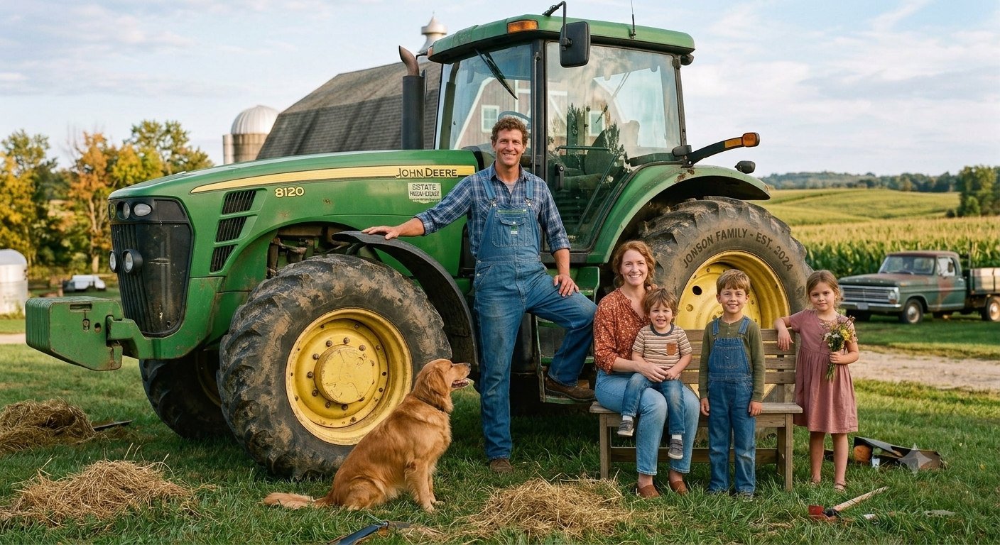
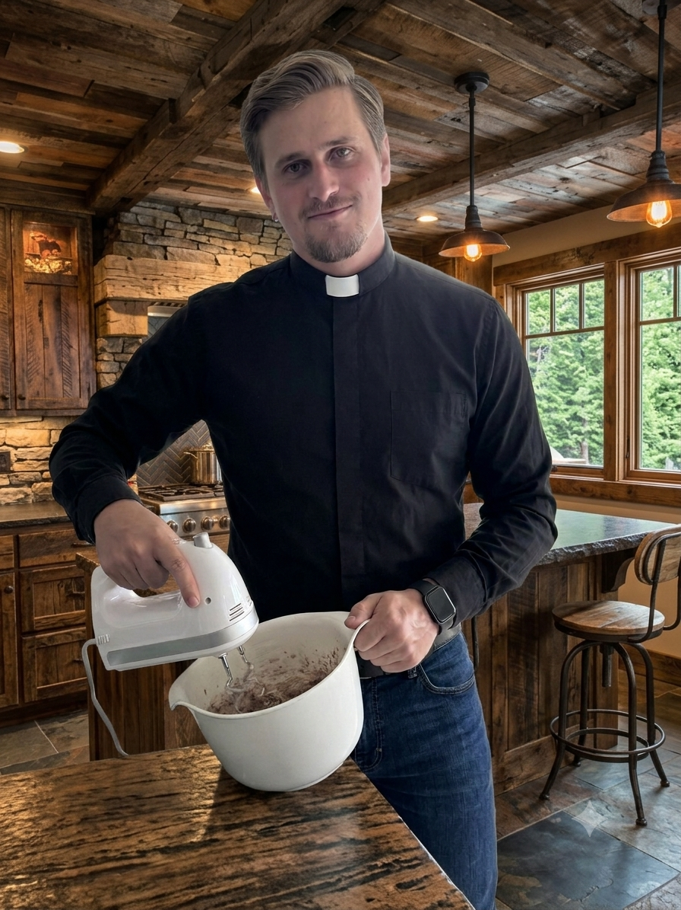
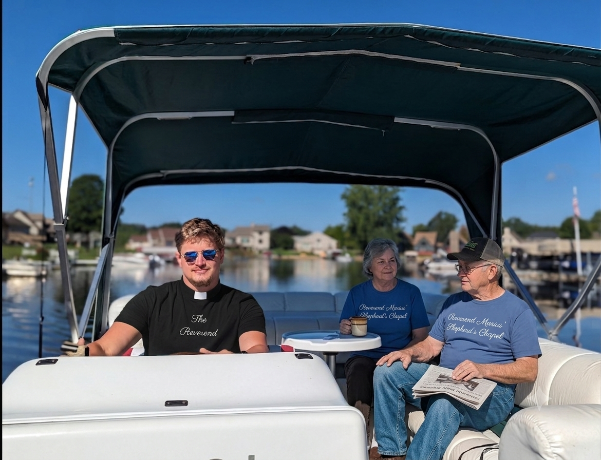

publish: 2026-07-26 09:00

# A Word From The Chapel

## A Harvest of Generosity

As many of you know, our dear Johnson family—Elias, Sarah, and their sweet children Caleb, Hannah, and Micah—faced a heavy burden recently. When their old tractor broke down, there was a very real fear that they would not be able to manage their fields or bring in their harvest of sweet corn and pumpkins this summer.

But praise be to God, our church community came together to lift that burden. Thanks to the overwhelming generosity of this congregation, Elias and Sarah were able to purchase a reliable, used 2008 John Deere tractor. We step up for one another because sharing is caring, and caring is an act of God given through us. The Johnsons' farm is safe, and their hearts are full of gratitude for their church family.

## Breaking Bread Together

There is something incredibly sacred about the simple act of making bread. Earlier this week, a lovely group from our church family gathered here at the Chapel to do just that. Whenever I knead the dough, my heart naturally turns to Jesus and the Last Supper. He showed us the beauty of breaking bread with whomever is at the table—not by dwelling on the sorrows that lay ahead, but by living fully in the moment and offering profound forgiveness.

If you would like to experience this beautiful fellowship, please join us the next time we host a community bread baking. You will leave our little Chapel with the joy of time spent with lovely people, a deep sense of faith, bliss in your heart, and a warm loaf in your hands.

## Still Waters and Sunshine

As I wrote earlier about the grace of being still, I am reminded of a beautiful afternoon a few of us shared just the other day. We took a boat out onto the lake, intentionally stepping away from the hustle and demands of our day-to-day lives. There is something profoundly restorative about simply sitting together on the water, sharing a gentle chat, and letting the world slow down.

As you can see in this lovely picture of Arthur and Elinor Vance and myself, we were truly blessed to have God's glorious light shining down upon us, warming both our faces and our spirits. It was a perfect reminder that He meets us in our times of rest just as much as in our times of work.

## Bearing One Another's Burdens

Before we close this week's letter, I want to share a heartfelt request from Emily Brooks. As a church family, one of our greatest privileges is lifting each other up in times of stress. Emily has asked for our collective prayers for her husband, Mark.

Mark works in auto-parts logistics, an industry currently facing a turbulent season of supply chain difficulties. The resulting long hours and uncertainty are understandably bringing up some heavy anxieties from past layoffs. Emily has asked that we join together in praying for three specific things: stability at his plant, favor with his supervisors, and, most importantly, a profound peace of mind when he walks through his front door at the end of the day. Please keep Mark and Emily in your hearts this week.

**No one should have to carry their burdens alone.** If you are in a rough situation and would like our church family to pray for you, please do not hesitate to submit your request at our [prayer page](https://donut335.github.io/Reverend-Marius-Shepherd-s-Chapel/prayer.html).

Yours in fellowship,
**Reverend Marius**
