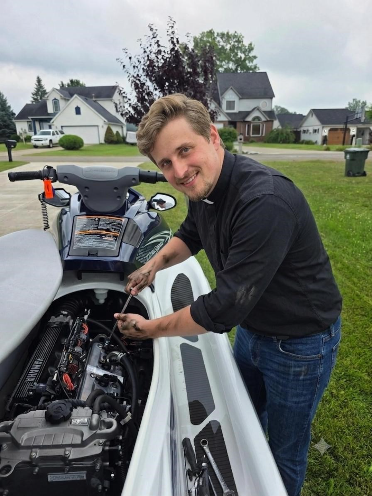
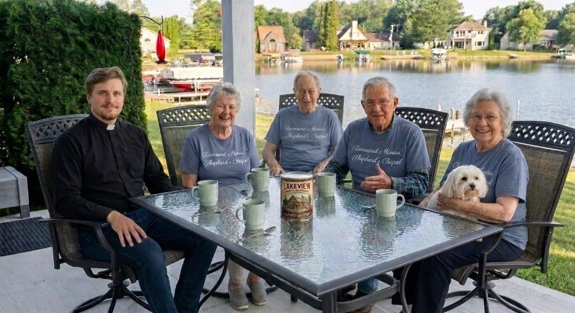
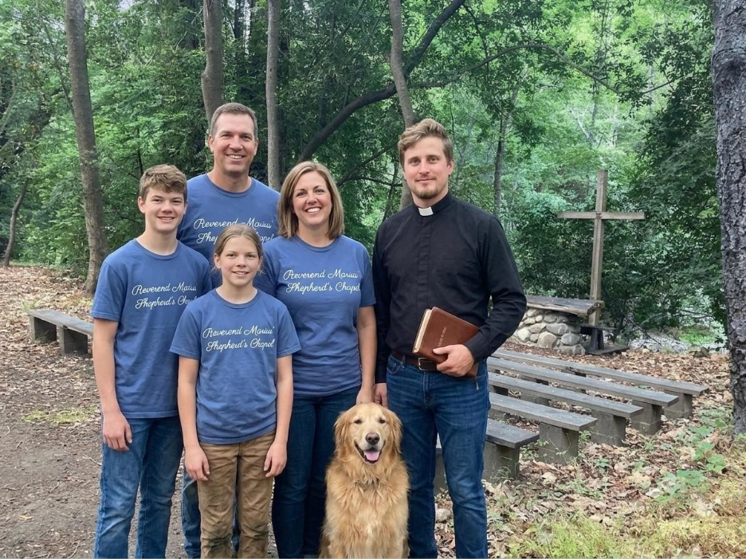

publish: 2026-08-02 09:00

# A Word From The Chapel

## A Potter's Hand in Everyday Life

This week, I had the quiet privilege of helping one of our elderly couples fix their jet ski. As I worked on the repairs, it brought to mind the words of Jeremiah 18:4:

*"And the vessel that he made of clay was marred in the hand of the potter: so he made it again another vessel, as seemed good to the potter to make it."*

Just as we are formed from clay and sometimes find ourselves in need of spiritual mending and grace, our everyday tools need tending to as well. I felt truly blessed to be able to use my hands to assist those who couldn't manage the repairs themselves. It was a humble, beautiful reminder of how we can do God's work in the most practical, everyday ways.

## A Blessed Morning with Coffee and Community

Nothing warms the spirit and prepares us for the day quite like the love of our Lord and Savior, Jesus Christ. But I must confess, a good cup of coffee and lovely conversation with the people of our special church commune certainly helps us remember all that we have to be grateful for.

We shared a wonderful morning together recently. It was a joy to catch up with Martha Barnson and see her little dog, Gideon, who has recovered splendidly since his operation. We also shared warm fellowship with Wallace and Beatrice Stanton, as well as Elder Thomas Holloway. These simple moments of connection are truly where the heart of our church beats the strongest.

## Upcoming: Camping for Jesus

As we look to the days ahead, please remember our upcoming "Camping for Jesus" event next week! We will be heading up north to a beautiful piece of land generously hosted by the Hayes Family. I am so looking forward to the fun we will have hiking through God's magnificent nature and sharing in our beloved Bible studies gathered around the crackling campfire.

## A Thought To Carry

Just as the potter shapes the clay, God's hands are constantly at work in our lives—whether we are turning a wrench, gathered around a morning coffee, or sitting together beneath the stars.

Yours in fellowship,
**Reverend Marius**
