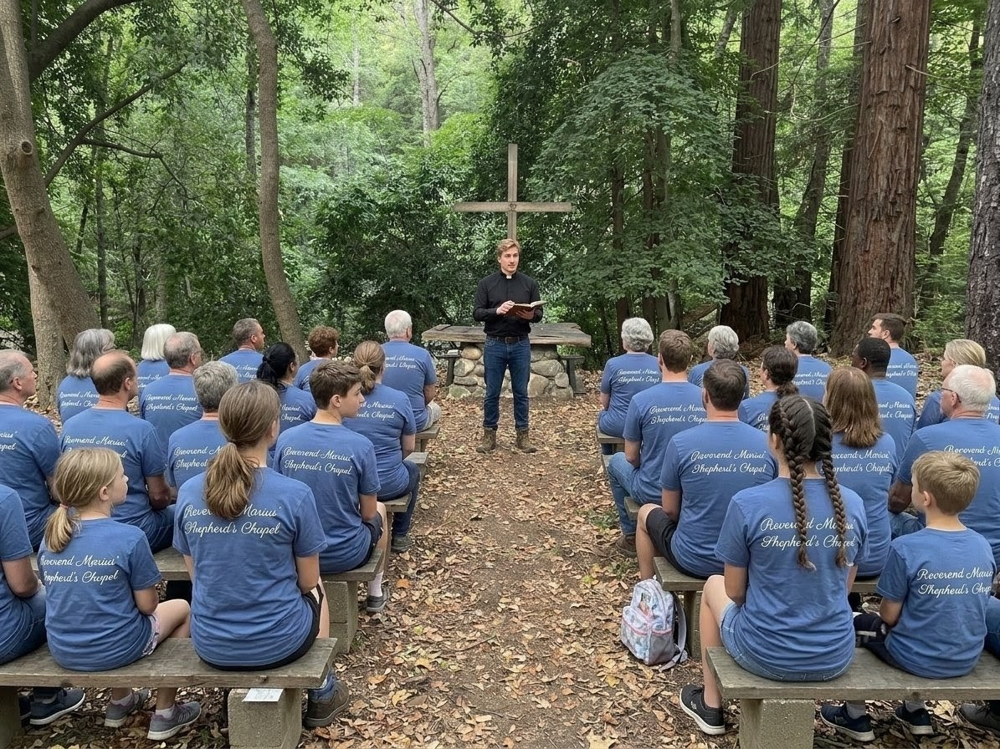
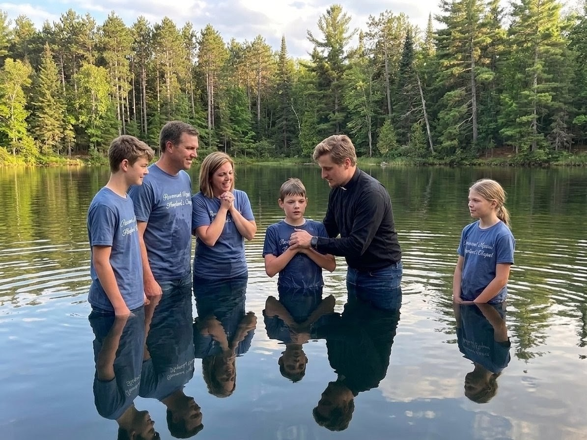
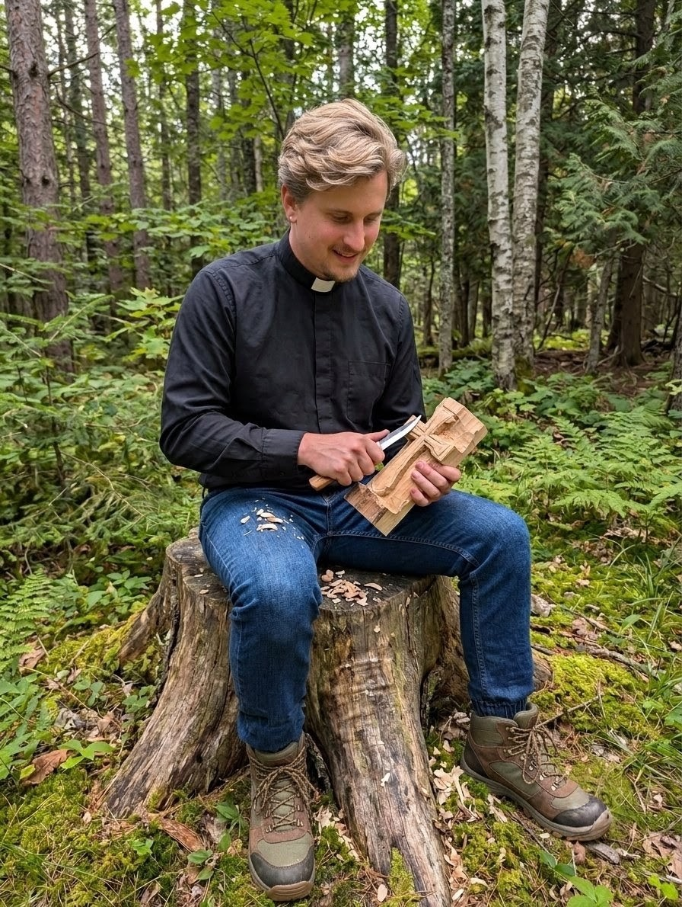

publish: 2026-08-09 09:00

# Home From the Woods, Hearts Full of Grace

Beloved friends of the Shepherd's Chapel,

What a blessed week it has been. We have returned from our "Camping for Jesus" gathering with tired feet, sun-warmed faces, and hearts fuller than when we left. Before I write another word, I must offer my deepest thanks to each and every one of you who came up north to join us. I confess I did not expect so many — young families, old friends, and a good number of new faces besides.

To see the Hayes Family's land filled with so much laughter and song was a gift I will not soon forget. Thank you, from the bottom of my heart, for coming out in such number to honor the Lord together beneath His open sky.

## A New Life in Still Waters

The most joyful moment of our days away came on the second morning, when young Daniel Ashcroft asked to be baptized in the lake. There is a verse that has stayed with me ever since:

*"And he baptized him in the Jordan... and straightway coming up out of the water, he saw the heavens opened." — Mark 1:9–10*

As Daniel waded out into that cool, still water with the morning mist still resting upon it, I do believe every one of us felt the heavens draw a little closer.

His mother, Ruth Ashcroft, wept for joy on the shore, and the whole congregation sang him back onto dry land. It was a plain lake on a plain morning, and yet it was as holy a place as any grand cathedral. God meets us in the water just as surely as He meets us in the sanctuary.

## Crosses Carved in the Quiet of the Woods

One afternoon a few of us wandered off among the trees and simply sat a while, talking of the Lord and all He had done for us that week. As we spoke, we gathered up a few fallen branches from the ground around us and, almost without thinking, began to carve small crosses from the wood the Lord had provided. There is a verse that came to my mind as the shavings curled away:

*"For the word of the cross is to them that perish foolishness; but unto us which are saved it is the power of God." — 1 Corinthians 1:18*

What a joy it was to sit together in the green stillness, young and old alike, each shaping something holy out of a plain piece of timber. I carved one myself that afternoon, and I confess I have grown quite attached to it. I intend to keep it always, for whenever I hold it I am carried straight back to those blessed days — the birdsong, the fellowship, and the faces of this church family gathered beneath God's own roof of branches.

So do keep an eye out for it come Sunday — my little cross now hangs in our lovely Chapel, where it will stand as a lasting reminder of this wonderful camping trip and all the grace the Lord poured out upon us during our days away. A humble thing carved from a fallen branch, and yet it holds a whole week of blessing within it.

## A Thought To Carry

The cross carved among the trees is small enough to fit in your pocket, yet it carries the whole weight of His love. Keep it close, and remember — you were shaped by patient hands, and you are carried still.

Yours in fellowship,
**Reverend Marius**
