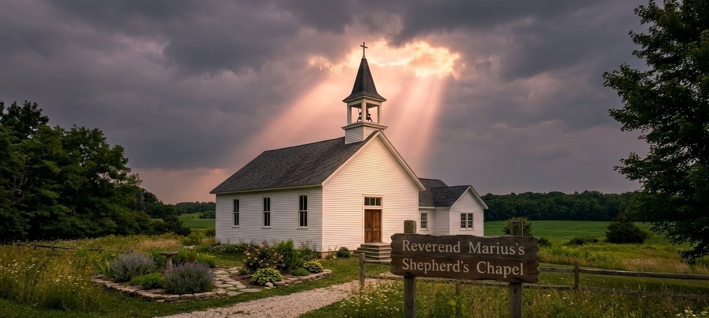

publish: 2026-08-16 09:00

# The Light Through the Clouds

Beloved friends of the Shepherd's Chapel,

I want to begin this week's letter with a small confession. As I was driving in to the Chapel one grey morning, my mind was crowded with the ordinary cares we all carry — the worries of the week, the little tasks left undone. And then, as I came up over the rise near our little sanctuary, the clouds parted and a single shaft of light came pouring down through them, falling right upon the Chapel roof.

There is a verse that rose up in my heart in that very moment:

*"Thy word is a lamp unto my feet, and a light unto my path." — Psalm 119:105*

I sat there a long moment and simply watched. It was as though the Lord Himself was reminding me that this church, and this community He has gathered here, is something set apart — something special. The path He lays before us is not always easy to see when the sky is grey and our hearts are heavy. But it is always there. We have only to be still, to listen, and to follow where He leads.

How often we rush past these quiet signs of His care! I drove the rest of the way with a lighter heart, and I carried that light with me all through the day. Friends, God is forever showing us the path we should take. Our part is simply to listen, and to walk it faithfully, one step at a time.

## A Blue Ribbon at the County Fair

What joy we have to share this week! Our own young Emily Henderson was over the moon at the Branch County Fair, where she took home the blue ribbon for her Holland Lop rabbit. Anyone who knows Emily knows how many early mornings she poured into the care of that little creature — feeding, grooming, and tending to it with a patience well beyond her years.

There is a lesson in this for all of us. The Lord entrusts each of us with small things — a garden, an animal, a neighbor in need — and it is in the faithful tending of these little things that our character is quietly shaped. Emily learned gentleness from a soft-tempered animal, and diligence from those countless early mornings. That blue ribbon will fade in time, but the patient, tender hands she has grown will serve her well for the whole of her life.

Well done, Emily. We are all so very proud of you, and we thank the Lord for the simple, wholesome joy He has given this church family through your hard work.

## Fare Thee Well, John Anderson

It is with a heavy but hopeful heart that I must share with you the passing of our dear friend and faithful brother, John Anderson, who went home to be with the Lord this week at the age of 78.

John was a man of quiet, steadfast faith — the kind of man who never sought attention, yet whose absence leaves a space none can quite fill. For years he was a familiar and beloved presence in our pews, and there was a gentle faithfulness about him that spoke far louder than any words. Those of us privileged to know him will remember his kindness, his steady hand, and the warmth of his company.

Let us hold his beloved family close in our prayers in the days ahead, that the Lord would wrap them in His comfort and remind them, in their sorrow, of the blessed hope we hold: that this parting is not forever. We do not grieve as those without hope, for we know that the good and faithful servant has simply gone on ahead of us, into the presence of the Master he served so well.

Rest now, John. Your course is finished, your faith is kept, and your welcome home is sure.

## A Thought To Carry

The same Light that breaks through the clouds to show us our path is the Light that waits to greet us at the end of it. Walk faithfully, love one another, and keep your eyes upon Him.

Yours in fellowship,
**Reverend Marius**
