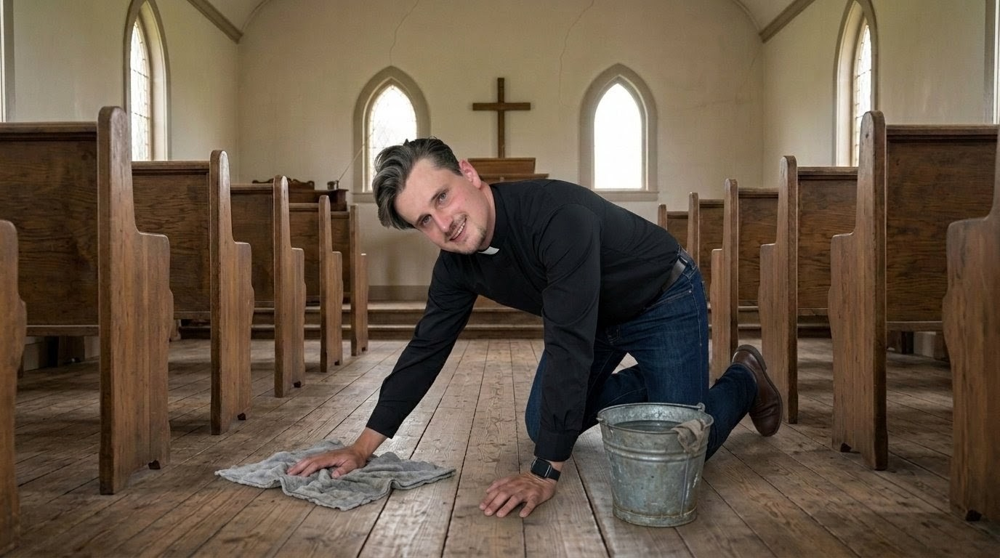
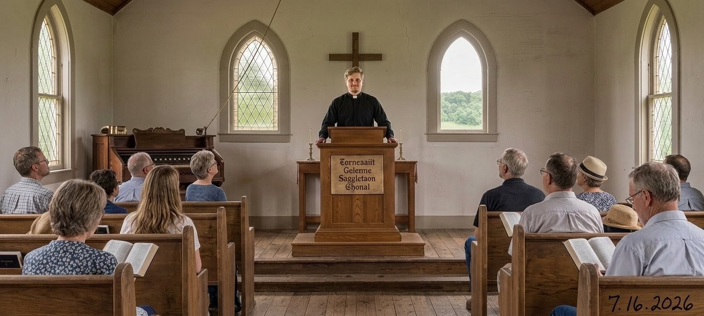

publish: 2026-08-22 09:00

# A Basket of Blessings at the Market

Beloved friends of the Shepherd's Chapel,

What a joyful week it has been! I had the great pleasure of traveling to the Ann Arbor Farmers Market to sell some of the wonderful produce the Lord blessed us with from our own Chapel garden. There is a special kind of happiness in watching a stranger's face light up over a basket of fresh vegetables, grown with our own hands in the good soil the Lord provided.

It warmed my heart to know that our little garden brought so much joy to so many people that morning. And the blessing does not end there — with the money we earned, we are able to purchase new Bibles to give away, free of charge, so that the good Word of our Lord and Savior might reach even more hearts. What began as a few seeds in the earth has become a harvest that will carry His truth out into the world. Truly, the Lord multiplies the smallest of our offerings.

## A Clean Chapel, A Clean Soul

This week I spent some quiet time cleaning our beloved Chapel, as I like to do once a year. I clean it as though I were about to gather up my things and leave for a whole year — every corner tended, every surface cared for.

As I worked, a thought settled upon me. A clean chapel is much like a clean soul. It is something you love to come back to, something you take pride in tending. And there is a verse that came to mind as I swept and dusted:

*"Create in me a clean heart, O God; and renew a right spirit within me." — Psalm 51:10*

A soul, like a chapel, needs only a little regular dusting to stay bright and welcoming. But if we forget to tend it — if we let the years pile up unattended — then instead of a gentle cleaning, we find ourselves needing a yard sale and a full remodel just to set things right. How much easier, and how much sweeter, to care for our souls a little at a time, keeping them ready for the Lord to enter.

## Looking Back to the First Sermon

This week my mind wandered back to the very first sermon I ever gave. It was such a long time ago now, and yet it still feels as though it were only a month past.

But then, time flies when you are having fun — and time spent with Jesus is always pure bliss. The years have gone by in a blessed blur of fellowship, worship, and grace, and I would not trade a single moment of them. What a gift it is to look back on a life of service and feel the Lord's hand upon every step of the road.

## A Thought To Carry

Whether we are tending a garden, sweeping a floor, or looking back on years gone by, the Lord meets us in the ordinary work of our days. Keep your soul as you would keep His house — clean, welcoming, and ready.

Yours in fellowship,
**Reverend Marius**
